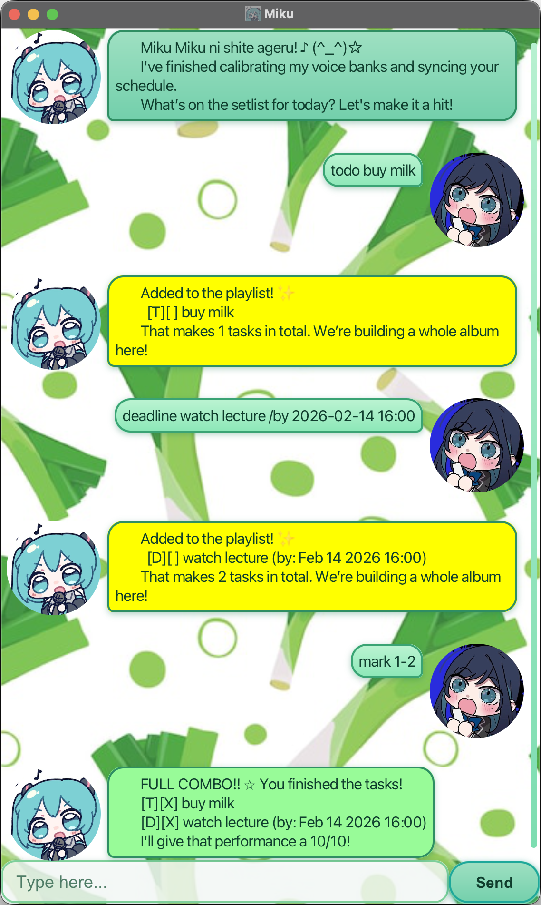

# Miku User Guide

Miku is a task-focused chatbot that helps you track todos, deadlines, and events in a fast, command-driven workflow.



## Quick start

1. Install Java `17` or later.
2. Download `Miku.jar`.
3. In the same folder as the jar, run:

    ```bash
    java -jar Miku.jar
    ```

4. Type commands in the input box and press Enter.

## Command format notes

- Commands are case-insensitive (e.g., `LiSt` works the same as `list`).
- Indexes are 1-based and refer to the list shown in the UI.
- For `mark`, `unmark`, and `delete`, you can use a single index, a comma list, or a range.
- Date/time input uses the format `yyyy-MM-dd HH:mm`.

## Features

### Add a todo: `todo`

Adds a task with no date/time.

Format: `todo DESCRIPTION`

Example: `todo read book`

### Add a deadline: `deadline`

Adds a task that must be done by a specific date/time.

Format: `deadline DESCRIPTION /by yyyy-MM-dd HH:mm`

Example: `deadline submit report /by 2026-01-30 12:00`

### Add an event: `event`

Adds a task that spans a time range.

Format: `event DESCRIPTION /from yyyy-MM-dd HH:mm /to yyyy-MM-dd HH:mm`

Example: `event project meeting /from 2026-01-30 12:00 /to 2026-01-30 22:00`

### List tasks: `list`

Shows all tasks.

Format: `list`

### Mark tasks as done: `mark`

Marks one or more tasks as completed.

Format: `mark INDEXES`

Examples:
- `mark 1`
- `mark 1, 3`
- `mark 2-4`

### Unmark tasks: `unmark`

Marks one or more tasks as not completed.

Format: `unmark INDEXES`

Examples:
- `unmark 1`
- `unmark 1, 3`
- `unmark 2-4`

### Delete tasks: `delete`

Deletes one or more tasks.

Format: `delete INDEXES`

Examples:
- `delete 2`
- `delete 1, 3`
- `delete 2-4`

### Find tasks by keyword: `find`

Finds tasks whose descriptions contain the keyword (case-insensitive).

Format: `find KEYWORD`

Example: `find report`

### Exit the app: `bye`

Closes Miku.

Format: `bye`

## Data storage

Tasks are saved automatically to `~/.miku/taskList.ser` after each command that changes your data.

## Command summary

| Action       | Format, Examples                                                                                                                          |
|--------------|-------------------------------------------------------------------------------------------------------------------------------------------|
| Add todo     | `todo DESCRIPTION` e.g., `todo read book`                                                                                                 |
| Add deadline | `deadline DESCRIPTION /by yyyy-MM-dd HH:mm` e.g., `deadline submit report /by 2026-01-30 12:00`                                           |
| Add event    | `event DESCRIPTION /from yyyy-MM-dd HH:mm /to yyyy-MM-dd HH:mm` e.g., `event project meeting /from 2026-01-30 12:00 /to 2026-01-30 22:00` |
| List         | `list`                                                                                                                                    |
| Mark         | `mark INDEXES` e.g., `mark 1`, `mark 1, 3`, `mark 2-4`                                                                                    |
| Unmark       | `unmark INDEXES` e.g., `unmark 1`, `unmark 1, 3`, `unmark 2-4`                                                                            |
| Delete       | `delete INDEXES` e.g., `delete 2`, `delete 1, 3`, `delete 2-4`                                                                            |
| Find         | `find KEYWORD` e.g., `find report`                                                                                                        |
| Exit         | `bye`                                                                                                                                     |
